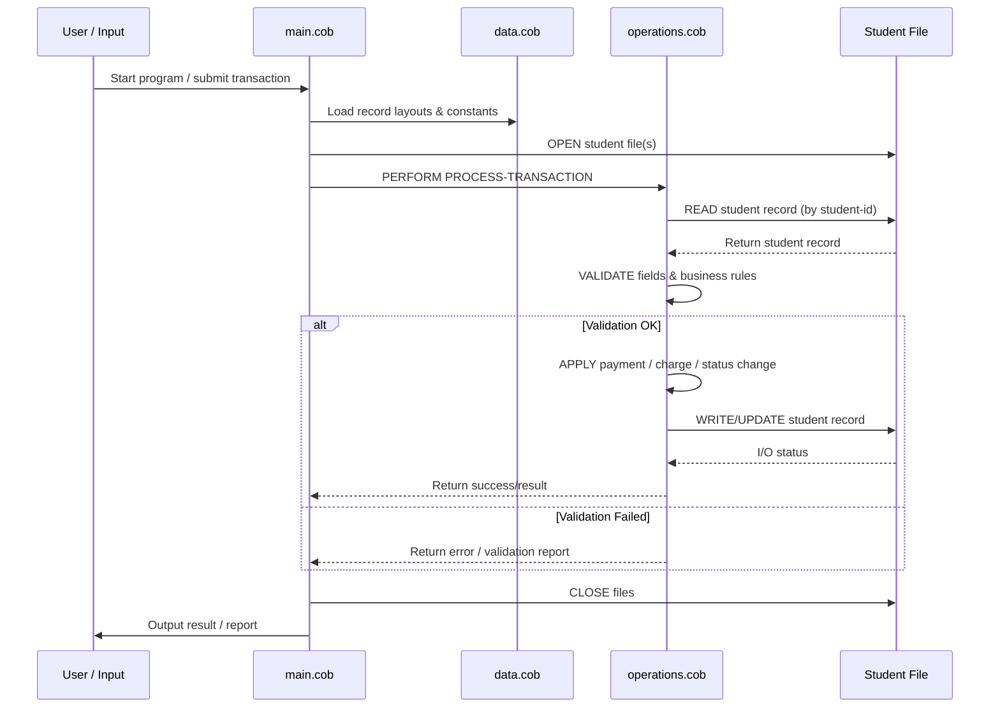

# COBOL Source Overview

This document describes the purpose and structure of the COBOL sources in `src/cobol/`, key program paragraphs (functions), and the assumed business rules for student accounts.

## Files

- `src/cobol/data.cob`
  - Purpose: central place for data descriptions and file layouts (FD/01 sections and WORKING-STORAGE entries).
  - Typical contents: student record layouts, field definitions (student-id, name, balance, status, enrollment-date, due-date, fees), file handlers and index/key definitions used across programs.

- `src/cobol/main.cob`
  - Purpose: program entry point and high-level control flow.
  - Typical contents: `IDENTIFICATION`, `ENVIRONMENT`, `DATA` and `PROCEDURE` sections that initialize the program, open files, dispatch to processing paragraphs, and handle shutdown/cleanup.

- `src/cobol/operations.cob`
  - Purpose: collection of reusable processing paragraphs (subroutines) that operate on student account records.
  - Typical contents: CRUD-like paragraphs for student accounts, transaction handling (charges, payments), validation routines, and reporting/print routines.

## Key paragraphs / functions (expected)

- `INITIALIZE` / `INIT-PROGRAM`: set up file status, open files, initialize counters and working-storage.
- `READ-INPUT` / `READ-STUDENT-FILE`: read the next student record or input transaction.
- `WRITE-OUTPUT` / `UPDATE-STUDENT-FILE`: write or update student records to output or update files.
- `CREATE-STUDENT` / `ADD-RECORD`: create new student account entries.
- `UPDATE-STUDENT` / `MODIFY-RECORD`: update details or balances for an existing student.
- `DELETE-STUDENT` / `CLOSE-ACCOUNT`: logically or physically remove student accounts.
- `CHARGE-FEE` / `APPLY-PAYMENT`: apply financial transactions to student balances.
- `VALIDATE-STUDENT` / `CHECK-REQUIRED-FIELDS`: verify required fields and business validations.
- `HANDLE-ERROR` / `FILE-STATUS-CHECK`: check file I/O status codes and perform error recovery.

Note: exact paragraph names may differ in source — search `PERFORM` targets in `main.cob` and `operations.cob` to find actual names.

## Assumed business rules for student accounts

The following business rules are documented as assumptions and should be verified against the COBOL code and domain owners:

- Student IDs: must be unique and are used as the primary key for file access.
- Required fields: student-id, last-name, first-name (or full name), and enrollment status must be present when creating an account.
- Account balance rules:
  - Balances are numeric and stored with an implied or explicit decimal; calculations must preserve scale.
  - Balances should not be allowed to go below zero unless an explicit credit/overdraft policy is supported.
  - Payments reduce balances; charges and fees increase balances.
- Late fees and due dates:
  - If a `due-date` field exists, a late fee may be applied when the current date is past the due date and a balance is unpaid.
  - Late fee amount and calculation method should be defined in `data.cob` or a configuration table.
- Status changes:
  - Account `status` transitions (e.g., `ENROLLED` → `SUSPENDED` → `CLOSED`) should be enforced by `VALIDATE-STUDENT` or related paragraphs.
  - Certain operations (e.g., registering for classes or applying charges) may be disallowed for suspended/closed accounts.
- Transaction atomicity:
  - File updates should be performed in a way that avoids partial updates (read/modify/write in a consistent sequence and check file status after each I/O).
- Audit and logging:
  - Financial changes should record who/what made the change and when, if the codebase supports an audit trail.

## How to verify and extend this documentation

- Inspect actual paragraph names and field names in the three COBOL files to replace the generic names above with exact identifiers.
- Search for `WORKING-STORAGE`, `FD`, `RECORD`, `PERFORM`, `FILE-STATUS`, and `RETURN-CODE` to locate data definitions and operations.
- Confirm business rules with stakeholders and encode constants (e.g., late-fee amount, credit limits) in `data.cob` or a configuration table.

If you'd like, I can scan the three COBOL files and replace the placeholder paragraph names above with the exact names and add a brief summary of each paragraph's logic.

## Sequence Diagram

The following Mermaid sequence diagram shows the high-level data flow between `main.cob`, `operations.cob`, `data.cob`, the student file storage, and the user/input system.

This diagram is a high-level view; I can refine it with exact paragraph names and file operations after scanning `src/cobol/` if you want.
